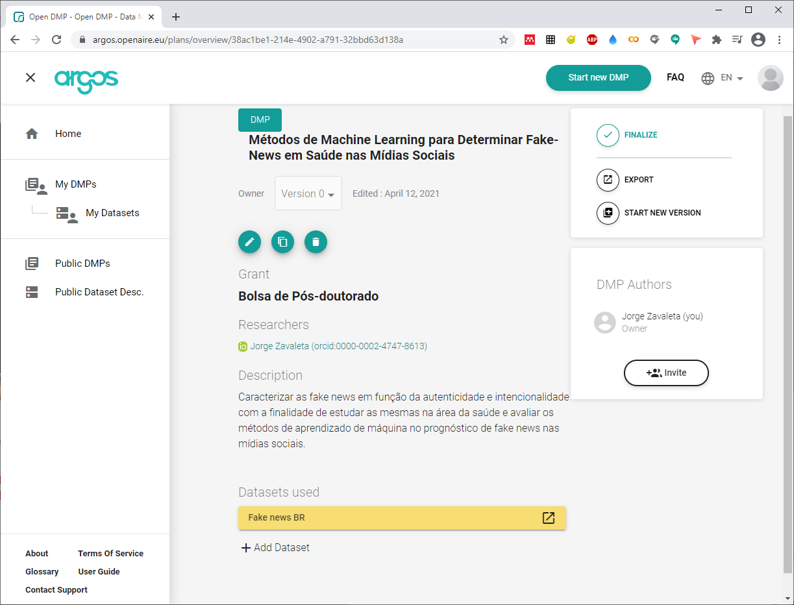

---
# Projeto de Pesquisa

---

---
> ## Métodos de Machine Learning para Determinar Fake News em Saúde nas Mídias Sociais
> ### Autor: Jorge Juan Zavaleta Gavidia
> ### ORCID: 0000-0002-4747-8613
> ### Instituição: Programa de Pós-graduação em Informática - Universidade Federal do Rio de Janeiro (Brasil)
> ### Fonte de Financiamiento: CAPES Tecnodigital

---
## Template do Plano de Gestão de dados (PGD)

---
## [Argos](https://argos.openaire.eu/)
---

---
> **DMPOnline** é uma ferramenta que apresenta de forma clara as informações necessárias e uma ajudas bem documentada para preencher o PGD. Pode ser licenciada para uso institucional e a UFRJ não faz parte de sua base de instituições licenciadas.
> Esta ferramenta conta com as seções de **detalhes do projeto**, **contribuidores**, **visão geral do plano**, **escrever o plano**,** compatilhar** e **download** e com 13 questões que devem ser respondidas sobre:
> - Coleta de dados (2 questões)
>> Tipos, formatos, volume e a metodologia usada para coletar ou criar os dados (dataset).
> - Documentação e metadados (1 questão)
>> Documentação e metadados que acompanham o dataset.
> - Ética e conformidade legal (2 questões)
>> Como será gerenciado as questões sobre a éticas, direitos autorais e propriedade inteletual.
> - Armazenamento e backup (2 questões)
>> Como será realizado o armazemaneto, backup, acessos e a segurança dos dados.
> - Seleção e preservação (2 questões)
>> Valor dos dados e tipo de repositório a ser usado para reter, compartilhar ou preservaar os dados.
> - Compartilhamento de dados (2 questões)
>>  Repositório, formato ou restrição requerida para compartilhar os dados.
> - Responsabilidade e recursos (2 questões)
>> Responsabilidades sobre o gerenciamento dos dados no projeto e repositórios.

---
> Outros **[Templates](pgd.md)** de gerenciamento de dados para o projeto.

---
## Citar como:

> Jorge Zavaleta. (2021, April 5). zavaleta/Machine-Learning-and-Fake-News: Repository of Machine Learning and Fake News (Version rfn_v1.0). Zenodo. http://doi.org/10.5281/zenodo.4663365

---
#### 
Plano de Gestão de dados,  Copyright &copy;  Jorge Zavaleta, 2021
