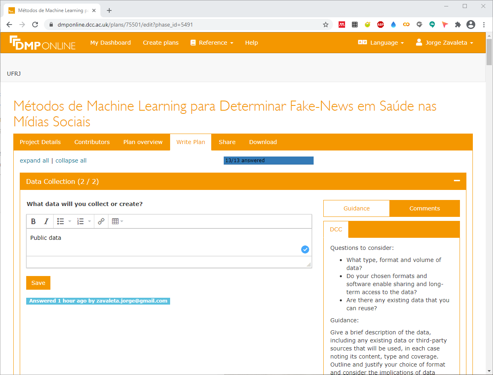

---
## Plano de Gestão de dados (PGD) Usando DMPOnline

---

---
## [DMPOnline](https://dmponline.dcc.ac.uk/)

---

---
> **DMPOnline** é uma ferramenta que apresenta de forma clara as informações necessárias e uma ajudas bem documentada para preencher o PGD. Pode ser licenciada para uso institucional.

> Esta ferramenta conta com as seções de **detalhes do projeto**, **contribuidores**, **visão geral do plano**, **escrita do plano**, **compartilhar**, **download** e com 13 questões sobre:

> - **Coleta de dados** (2 questões)
>> Tipos, formatos, volume e a metodologia usada para coletar ou criar os dados (dataset).

> - **Documentação e metadados** (1 questão)
>> Documentação e metadados que acompanham o dataset.

> - **Ética e conformidade legal** (2 questões)
>> Como será gerenciado as questões sobre a éticas, direitos autorais e propriedade intelectual.

> - **Armazenamento e backup** (2 questões)
>> Como serão realizados o armazenamento, backup, acessos e a segurança dos dados.

> - **Seleção e preservação** (2 questões)
>> Valor dos dados e tipo de repositório a ser usado para reter, compartilhar ou preservar os dados.

> - **Compartilhamento de dados** (2 questões)
>>  Repositório, formato ou restrição requerida para compartilhar os dados.

> - **Responsabilidade e recursos** (2 questões)
>> Responsabilidades sobre o gerenciamento dos dados no projeto e repositórios.

> Esta ferramenta permite gerar PGD em formatos de **csv**, **html**, **text**, **docx**, **json** e **pdf**.

---

> Outros **[Templates](pgd.md)** de gerenciamento de dados para o projeto.

---

## Citar como:

> Jorge Zavaleta. (2021, April 5). zavaleta/Machine-Learning-and-Fake-News: Repository of Machine Learning and Fake News (Version rfn_v1.0). Zenodo. https://doi.org/10.5281/zenodo.4697918

---

#### 
Plano de Gestão de dados,  Copyright &copy;  Jorge Zavaleta, 2021
