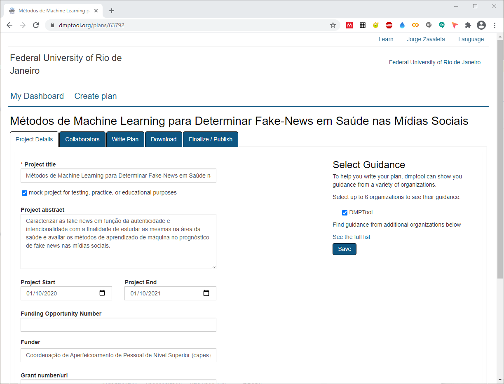

---

## Plano de Gestão de Dados Usando DMPTool

---

---
## [DMPTool](https://dmptool.org/)
---

---
> **DMPTool** é uma ferramenta que apresenta um menu com as seguintes opções:

> - **Detalhar informações do projeto**
>> Informações sobre o projeto como título, resumo, datas de inicio e termino, Fonte de Financiamento.

> - **Autores e contribuidores**
>> Pesquisadores principal, equipe envolvida e o role deles noprojeto.

> - **Redação do plano**
> Nesta seção devem ser respondidas 13 questões ao respecto de:

>> **Coleção de Dados (2 questões)**
>>> Tipos dos dados a ser coletados ou criados, formatos, volume e a metodologia usada para coletar ou criar os dados.

>> **Documentatação e metadados (1 questão)**
>>> Documentação e metadados anexos ao PGD e que permitam a leitura e interpretação no futuro.

>> **Ética e conformidad legal (2 questões)**
>>> Gestão das questões éticas, direitos autorais e propriedade intelectual e reuso de dados.

>> **Armazenamento e Backup (2 questões)**
>>> Formas de armazenanto e backup dos dados durante o projeto e a gestão de acesso e segurança dos dados.

>> **Seleção e Preservação (2 questões)**
>>> Plano para reter, compartilhar, preservar e o tempo de duração dos *datasets*.

>> **Compartilhamento de dados (2 questões)**
>>> Forma para compartilhar os dados e/ou restrições sobre os mesmos.

>> **Responsabilidades e recursos (2 questões)**
>>> Responsavél pela gestão dos dados e recursos necessarios para entregar o PGD.

> - **Download**
>> Formados nos quais é gerado o PGD: **csv**, **html**, **text**, **docx** e **json**.
> - **Finalizar e publicar**
>> Determinar a visibilidade pública e organizacional do PGD.

---
> Outros **[Templates](pgd.md)** de gerenciamento de dados para o projeto.

---
## Citar como:

> Jorge Zavaleta. (2021, April 5). zavaleta/Machine-Learning-and-Fake-News: Repository of Machine Learning and Fake News (Version rfn_v1.0). Zenodo. http://doi.org/10.5281/zenodo.4663365

---
#### 
Plano de Gestão de dados,  Copyright &copy;  Jorge Zavaleta, 2021
