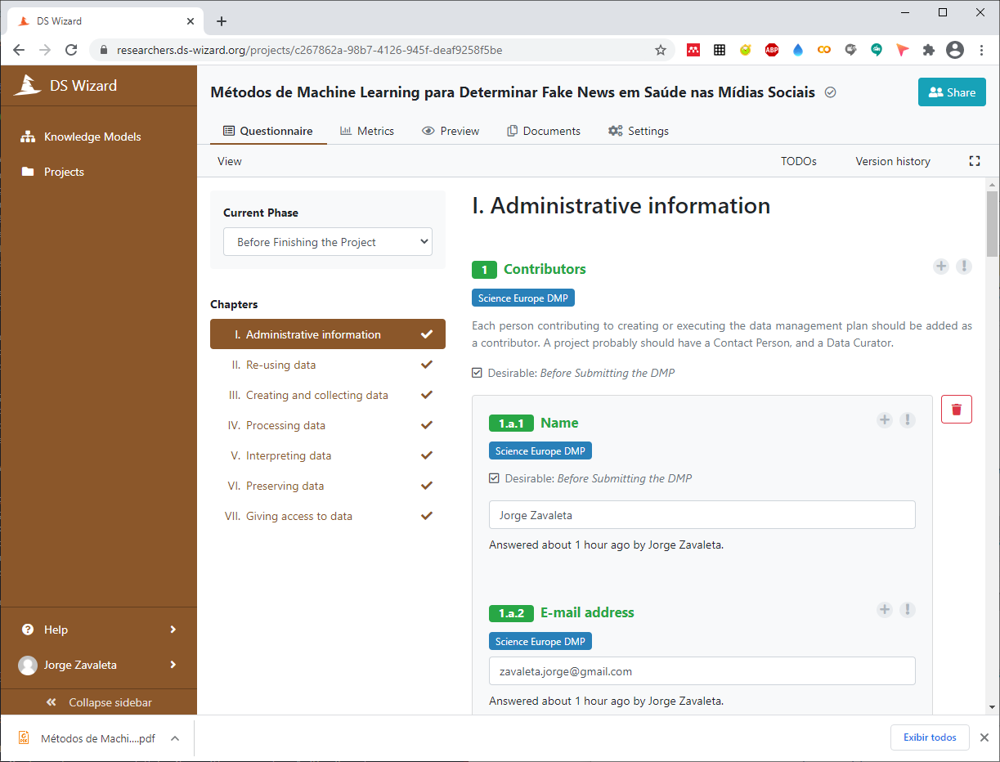
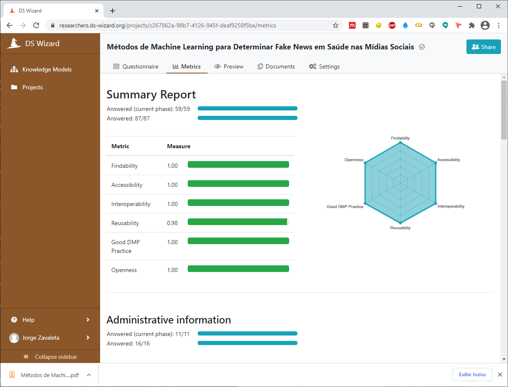

---
## Plano de Gestão de dados (PGD) Usando DS-Wizard

---

---
## [DS-Wizard](https://ds-wizard.org/)

---

---
> **DS-Wizard** é uma ferramenta que apresenta dois modelos de conhecimento para gerar os PGDs e 3 modelos estandardizados (Horizon 2020 DMP, Science Europe DMP e maDMP) a partir dos quais são feitas as questões e ajuda para responder as mesmas. Esta ferramenta conta com seções de:
> **Questionário** que apresenta oito capítulos com suas respectivas questões:
> - Capítulo 1: Informação Administrativa
>> Informações administrativas sobre o projeto, autor ou envolvidos no projeto, ORCID, e-mail, instituição, role e sua expertise para usar o PGD.
> - Capítulo 2: Reuso dos dados
>> Verificar o reuso de dados existentes, coleta ou geração de dados.
> - Capítulo 3: Criação e coleta de dados
>> Conhecimento dos dados usados, gerados para o projeto o espeço para armazenar os mesmos.
> - Capítulo 4: Processamento dos dados
>> Os dados passarão pelas etapas de pré-processamento  e limpeza.
> - Capítulo 5: Interpretação dos dados
>> Questões sobre interoperabilidade e visualização dos dados.
> - Capítulo 6: Preservação dos dados
>> Padronizar a denominação dos nomes dos datasets adquiridos, processados e aos de resultado de processo computacionais ou mistura deles.
> - Capítulo 7: Acesso aos dados
>> Informações necessárias para outros pesquisadores que vão utilizar os dados (dados abetos ou restrições sobre eles).

> **Métricas**
>> Descrevem questões relacionadas com os princípios FAIR. Além de apresentar estes relacionamentos e sua medida em forma gráfica

> **visualização**
>> Apresenta a visualização do PGD no formato escolhido.

> **documentos**
>> Formato do documento final gerado pela ferramenta **html**, **latex**, **text**, **pdf**, **docx** e **markdown**.

> **configurações**.
>> Ajusta o nome do projeto, *template* e formato final do documento a ser gerado.

---
O DS-Wizard é uma ferramenta abrangente, ela se conecta com recursos externos (por exemplo, FAIRSharing, FAISsFAIR), avalia as respostas dos questionários em termos de métricas preditivas automatizadas para a prática FAIR e Open Science, como mostrado na figura a seguir.

---
> Outros **[Templates](pgd.md)** de gerenciamento de dados para o projeto.

---
## Citar como:

> Jorge Zavaleta. (2021, April 5). zavaleta/Machine-Learning-and-Fake-News: Repository of Machine Learning and Fake News (Version rfn_v1.0). Zenodo. http://doi.org/10.5281/zenodo.4663365

---
#### 
Plano de Gestão de dados,  Copyright &copy;  Jorge Zavaleta, 2021
