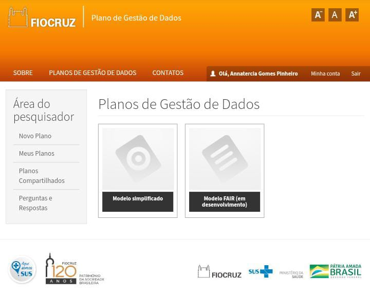

---
## Plano de Gestão de Dados (PGD)

---

---
## [Fiocruz]()

---

---
> O *template* de PGD é customizado e ajustado às necessidades da instituição, essa plataforma conta com duas opções de preenchimento: o modelo simplificado e o modelo FAIR, ambas divididas por seções que contemplam informações administrativas; descrição dos dados e/ou reuso dos dados existentes; documentação e qualidade dos dados; armazenamento e backup; requisitos legais e compartilhamento dos dados e preservação a longo prazo.
> O PGD conta com textos explicativos para auxiliar no seu preenchimento, visando simplificar ao máximo o trabalho dos pesquisadores e considerando a diversidade de demandas.

> Este *template* de plano foi retirado de [Veiga et al., 2019] com fines educacionais e consta das seguintes seções:

> **Seção A**: Informações Adminstrativas
>> A1 - Informe o nome completo do pesquisador principal
>> A2 - Informe o *e-mail* de Contato
>> A3 - Qual o seu telefone?
>> A4 - Informe o *link* do Currículo Lattes do Pesquisador Principal
>> A5 - Informe o *link* do **ORCID** do Pesquisador Principal
>> A6 - Informe o título do seu projeto
>> A7 - Descreva o resumo do projeto
>> A8 - A qual Unidade da Fiocruz o seu projeto está vinculado?
>> A9 - Qual a data de início do projeto?
>> A10 - Indique a previsão de término do projeto
>> A11 - O projeto tem financiamento?
>> A12 - Especifique o financiamento
>> A13 - Qual a versão deste Plano de Gestão de Dados?
>> A14 - Quem será o responsável pelo preenchimento e atualização do Plano de Gestão de Dados?

> **Seção B**: Descrição dos dados coletados ou reuso de dados existentes
>> B1 - Como os dados serão coletados, produzidos ou como os dados existentes serão reutilizados?
>> B2 - Quais os tipos de dados que serão coletados ou produzidos?
>> B3 - Quais os formatos de dados que serão coletados ou produzidos?
>> B4 - Qual o volume aproximado dos dados coletados ou produzidos?

> **Seção C**: Documentação e Qualidade dos Dados
>> C1 - Indique os metadados adotados
>> C2 - Indique o padrão de metadados adotado
>> C3 - Indique os documentos que acompanharão os dados
>> C4 - Indique as medidas adotadas para a organização e controle de qualidade dos dados

> **Seção D**: Armazenamento e Backup durante o processo de pesquisa 
>> D1 - Como os dados serão armazenados e como serão feitas as cópias de segurança durante a pesquisa?
>> D2 - Como a segurança dos dados e a proteção dos dados sensíveis serão tratadas durante a pesquisa.

> **Seção E**: Requisitos Legais, Éticos e de Códigos de Conduta
>> E1 - Se os dados pessoais forem tratados, como será assegurado o cumprimento da legislação relativa aos dados pessoais e à proteção dos dados?
>> E2 - Como as questões legais referentes aos direitos de propriedade intelectual serão gerenciadas? Qual legislação se aplica?
>> E3 - Indique a licença que será aplicada.
>> E4 - Como as possíveis questões éticas e os códigos de conduta serão levados em consideração?

> **Seção F**: Compartilhamento de Dados e Preservação a longo prazo
>> F1 - Como e quando os dados serão compartilhados? Existem possíveis restrições ao compartilhamento e/ou à abertura de dados ou motivos para embargo?
>> F2 - Como os dados para preservação serão selecionados e onde os dados serão preservados a longo prazo (por exemplo, em um repositório de dados)?
>> F3 - Quais métodos ou ferramentas de software serão necessários para acessar e usar os dados?
>> F4 - Como será assegurado o registro de um identificador único e persistente (como um DOI - Digital Object Identifier) para cada conjunto de dados?

> **Seção G**: Responsabilidades e Recursos Financeiros para a Gestão de Dados de Pesquisa.
>> G1 - Quem será o responsável pela gestão dos dados?
>> G2 - Quais recursos (ex.: financeiros, tempo) serão dedicados à gestão de dados e à garantia que eles sejam FAIR (localizável, acessível, interoperável, reutilizável)?
>> G3 - Para projetos colaborativos, explique como será a coordenação da gestão de dados e as responsabilidades de cada um dos parceiros

> O PGD pode ser exportado após seu preenchimento no formato **pdf**.

---
> Outros **[Templates](pgd.md)** de gerenciamento de dados para o projeto.

---
#### Referências
> Veiga, V. S. de O., Henning, P., Dib, S., Penedo, E., Lima, J. D. C., Silva, L. O. B. da, and Pires, L. F. (2019). Plano de gestão de dados fair: uma proposta para a Fiocruz. Liinc Em Revista, 15(2), 275–286. https://doi.org/10.18617/liinc.v15i2.5030

---
### Citar como:

> Jorge Zavaleta. (2021, April 5). zavaleta/Machine-Learning-and-Fake-News: Repository of Machine Learning and Fake News (Version rfn_v1.0). Zenodo. http://doi.org/10.5281/zenodo.4663365

---
#### 
Plano de Gestão de dados,  Copyright &copy;  Jorge Zavaleta, 2021
